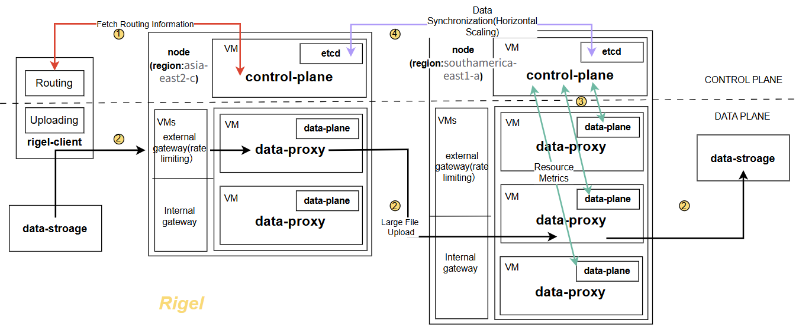

# Rigel

## Overview
Rigel is a distributed system designed for scalable and resilient global data forwarding, built on a two-level resource abstraction and a decoupled control–data plane architecture. This document outlines the core implementation details and system architecture.

---

## Two-Level Resource Abstraction
Rigel's resource model follows the natural hierarchy of cloud infrastructure:

- **Virtual Machines (VMs)**: Represent individual cloud instances (e.g., `instance-20260202-081825`). They serve as the fundamental execution unit for data forwarding and network measurement.
- **Nodes**: Group multiple VMs and typically map to a cloud region (e.g., `europe-west4-b`). Nodes act as the basic unit for resource management and scheduling decisions.

---

## Architecture Design

### Vertical Control–Data Plane Separation
Rigel is organized into two distinct planes with clear responsibility boundaries:

1. **Control Plane**
    - **Core Responsibilities**: Routing optimization, elastic scaling, and regional decision coordination.
    - **Deployment Rule**: Exactly one `control-plane` instance runs per node to manage intra-region logic.
    - **State Storage**: Relies on `etcd` for persistent and consistent state management across the system.

2. **Data Plane**
    - **Deployment Granularity**: Deployed at the VM level (one instance per VM).
    - **Core Services**:
        - `data-plane`: Collects and reports local resource metrics, performs active network probing, and gathers real-time telemetry.
        - `data-proxy`: Executes the actual file proxying and low-latency data forwarding operations.
    - **Gateway Layer**: Nodes provide external/internal gateways with rate limiting on external access to ensure traffic stability.

3. **Edge Client (rigel-client)**
    - Runs at the system edge (user side) to provide access to the Rigel network.
    - Key functions: File chunking, multi-path parallel transmission, and large file upload optimization.

### Horizontal State Synchronization
To enable distributed routing and scheduling across regions:
- `control-plane` instances across nodes synchronize state in real time.
- Each node maintains a consistent global view of system states without a centralized controller.
- Independent routing decisions per node enhance system robustness against failures and support large-scale deployments.

---

## Implementation Architecture Diagram
The detailed architecture and module relationships are shown below:

### Figure Caption
**Rigel implementation architecture**, illustrating the two-level resource abstraction (VMs and nodes) and the decoupled control–data plane design. The control plane, with one instance per node, handles routing optimization and elastic scaling, while the data plane, deployed at the VM level, performs resource metrics collection, network probing, and data forwarding operations. Horizontal state synchronization among control-plane instances enables distributed, resilient routing decisions across cloud regions.

---

## Key Workflows (Supplemental)
Based on the architecture diagram, core workflows include:
1. `rigel-client` initiates large file upload requests and chunks files into segments.
2. Client fetches optimal routing information from the control plane.
3. Data plane reports real-time resource metrics to the control plane.
4. Control plane synchronizes state across nodes via `etcd`.
5. Data-proxy executes parallel data forwarding across multiple paths.
6. Rate limiting at the external gateway controls inbound/outbound traffic.